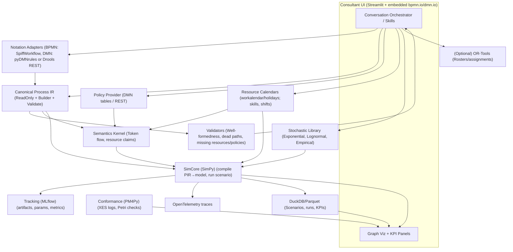

# Agentic Process Automation

---

**Purpose:**

An agent that can work with process owners to formalize their processes and figure out how to automate them.

It's an AI front end, acting as a business process consultant, but armed with a simulation engine for testing and validating process changes before they are implemented.

---

## Major Components

1. **Code for describing business processes as objects**  
     (speaking BPMN/DMN/CMMN/ArchiMate)
2. **A simulation engine** for testing, validating and analyzing process changes before they are implemented.
3. **An agentic front end** with a conversational interface and a visualization layer for the process they are mapping.

---

## Architecture Diagram



---


pm4py-source.readthedocs.io
salabim.org

## Libraries to Use

### Model Adapters (BPMN / DMN / CMMN / ArchiMate)

- **BPMN parsing & execution (Python-native):**  
    [SpiffWorkflow](https://spiffworkflow.org) loads/executes BPMN 2.0 (gateways, subprocesses, timers, etc.). Great when you want everything in Python and don’t want a JVM.

- **Process-mining sidecar:**  
    [PM4Py](https://pm4py-source.readthedocs.io) for reading BPMN, converting to Petri nets, conformance checking, and working with event logs (XES). Useful for validation and as a truth meter.

- **DMN decision tables:**  
    [pyDMNrules](https://github.com/alexanderjarvis/pyDMNrules) (Python FEEL + Excel-backed DMN) for lightweight, Python-only DMN. For full DMN coverage or higher performance at scale, wrap a hosted Drools/KIE Server DMN endpoint via REST and keep a thin Python client.  
    [Drools DMN](https://docs.drools.org)

- **CMMN (case management):**  
    Don’t build: use Flowable’s CMMN engine and call via REST/webhooks; let it persist plan items & sentries while your app stays stateless.  
    [Camunda](https://camunda.com)

- **ArchiMate catalogs:**  
    Use pyArchimate to read/write the official ArchiMate Model Exchange XML (export from the Archi desktop tool) so you can resolve capabilities/apps → processes without inventing a format.

### Simulation & Analysis

- **Discrete-event simulation core:**  
    You already have SimPy. Alternatives: [Ciw](https://github.com/CiwPython/Ciw) (queueing networks) and [salabim](https://salabim.org) (SimPy-like with built-in animation/monitoring).

- **Calendars, shifts, SLAs:**  
    [workalendar](https://workalendar.github.io) (business calendars, workday arithmetic) and [holidays](https://holidays.readthedocs.io) (country/state holidays) to keep resource calendars realistic.

- **Optimization (staffing, routing, batching):**  
    [OR-Tools](https://developers.google.com/optimization) (CP-SAT) for shift/roster, job-shop, and assignment constraints; call it from SimPy experiments for what-if optimization.

- **Event logs & standards:**  
    Use XES (IEEE 1849) for logs so PM4Py and other tools interoperate out of the box.  
    [IEEE Standards Association](https://standards.ieee.org)

### Agentic Front End (Conversation + Tools)

- **LLM orchestration:**  
    [LangChain](https://langchain.com) or [LlamaIndex](https://llamaindex.ai) for tool calling & retrieval; [DSPy](https://github.com/stanfordnlp/dspy) if you prefer declarative, optimizer-driven prompts and structured outputs. Pick one to avoid stack sprawl.  
    [Weights & Biases](https://wandb.ai)  
    [MLflow](https://mlflow.org)

- **Observability & evals:**  
    [OpenTelemetry](https://opentelemetry.io) (Python) for tracing every tool call/simulation run; [Arize Phoenix](https://arize.com/phoenix/) to visualize traces and run LLM evals (e.g., hallucination/toxicity) on conversations.

- **Experiment tracking:**  
    [MLflow Tracking](https://mlflow.org) (self-hosted, simple) or [Weights & Biases](https://wandb.ai) (hosted, batteries included) to log scenarios, KPIs, and artifacts from each simulation.

### Visualization & Editing

- **Process/decision editors (browser):**  
    [bpmn.io](https://bpmn.io) (bpmn-js) and dmn-js give you production-grade modeling UIs you can embed; talk JSON back to Python.  
    [Open Group](https://www.opengroup.org)  
    [ArchiMate Tool](https://archimatetool.com)

- **Graph/process views (custom):**  
    [Cytoscape.js](https://js.cytoscape.org) for interactive dependency/hand-off graphs when you want to visualize beyond BPMN/DMN.

- **Python app shells:**  
    [Streamlit](https://streamlit.io) (fast internal apps) or [Reflex](https://reflex.dev) (full-stack Python→React without touching JS) for your consultant-facing UI.

### Storage & Data Plumbing (Local-First, Reproducible)

- **Fast local analytics:**  
    [DuckDB](https://duckdb.org) (in-process OLAP) + [Polars](https://pola.rs) (fast DataFrame) for scenario data, KPI rollups, and model outputs — zero infra required.

- **Versioning (optional):**  
    If you need git-like branching for datasets/scenario bundles, consider [DVC](https://dvc.org) or [lakeFS](https://lakefs.io); otherwise keep it simple with DuckDB/Parquet.

### Durable Orchestration (When Simulations Kick Off Long Jobs)

- **Workflow durability:**  
    [Temporal](https://temporal.io) (Python SDK) for crash-proof, resumable workflows (e.g., multi-step discovery → simulation → optimization → report). If you want simpler, use [Prefect](https://www.prefect.io) for Pythonic orchestration & scheduling.

### Rules (When DMN is Overkill)

- **Lightweight rules engines:**  
    [durable_rules](https://pypi.org/project/durable-rules/) (Rete-based, CEP) or [business-rules](https://pypi.org/project/business-rules/) (simple Python DSL) to express quick guardrails without spinning up a full DMN server.

---

## Pragmatic MVP Pick List

If you want to ship quickly with minimal custom code:

- **Model I/O:** SpiffWorkflow (BPMN), pyDMNrules (DMN); optionally wrap Drools DMN over REST later.  
    [SpiffWorkflow](https://spiffworkflow.org)  
    [pyDMNrules](https://github.com/alexanderjarvis/pyDMNrules)  
    [Drools DMN](https://docs.drools.org)

- **Sim & analysis:** SimPy + workalendar/holidays + OR-Tools; PM4Py for conformance checks.  
    [workalendar](https://workalendar.github.io)  
    [holidays](https://holidays.readthedocs.io)  
    [OR-Tools](https://developers.google.com/optimization)  
    [PM4Py](https://pm4py-source.readthedocs.io)

- **UI:** Streamlit for the consultant cockpit + bpmn.io / dmn.io embedded editors.  
[Streamlit](https://streamlit.io)  
[bpmn.io](https://bpmn.io)  
[ArchiMate Tool](https://archimatetool.com)

- **Tracking & observability:** MLflow for runs; OpenTelemetry + Phoenix for traces/evals.  
    [MLflow](https://mlflow.org)  
    [OpenTelemetry](https://opentelemetry.io)  
    [Arize Phoenix](https://arize.com/phoenix/)

- **Data layer:** DuckDB + Polars for fast, local scenario storage.  
    [DuckDB](https://duckdb.org)  
    [Polars](https://pola.rs)

---


## Integration Glue (Python-First Skeleton)

**Project layout:**

```text
agentic_process_automation/
    app/                # UI + orchestration
        main.py
        editors.py        # bpmn.io / dmn.io embeds
    core/
        pir.py            # Canonical IR + builder + validators
        adapters/
            bpmn_spiff.py
            dmn_provider.py
        semantics.py
        sim.py
        stochastic.py
        resources.py
        scenario.py
    qa/
        conformance_pm4py.py
    ops/
        tracking.py
        telemetry.py
        storage.py
        optimize_roster.py
    requirements.txt
```

---


## Core Contracts (Minimal, Stable)

### `core/pir.py`

```python
from dataclasses import dataclass, field
from typing import Dict, List, Optional

@dataclass(frozen=True)
class Node:
    id: str
    kind: str
    name: str
    lane: Optional[str] = None
    policy_ref: Optional[str] = None

@dataclass(frozen=True)
class Edge:
    src: str
    dst: str
    guard: Optional[str] = None

@dataclass
class PIR:
    nodes: Dict[str, Node] = field(default_factory=dict)
    edges: List[Edge] = field(default_factory=list)
    resources: Dict[str, dict] = field(default_factory=dict)  # pools, skills
    metadata: Dict[str, str] = field(default_factory=dict)

class PIRBuilder:
    def __init__(self, pir: Optional[PIR] = None):
        self.pir = pir or PIR()
    def add_node(self, **kw):
        self.pir.nodes[kw["id"]] = Node(**kw)
        return self
    def add_edge(self, **kw):
        self.pir.edges.append(Edge(**kw))
        return self
    def set_resource_pool(self, rid: str, cfg: dict):
        self.pir.resources[rid] = cfg
        return self
    def build(self) -> PIR:
        return self.pir

def validate(pir: PIR) -> dict:
    errors, warnings = [], []
    ids = set(pir.nodes.keys())
    for e in pir.edges:
        if e.src not in ids or e.dst not in ids:
            errors.append(f"Broken edge {e}")
    # very light checks; add dead-path, unreferenced policy, etc.
    return {"errors": errors, "warnings": warnings}
```


### `core/adapters/bpmn_spiff.py`

```python
from spiffworkflow.bpmn.parser import BpmnParser

def from_bpmn_xml(xml_bytes: bytes):
    parser = BpmnParser()
    wf_spec = parser.parse_xml_string(xml_bytes.decode("utf-8"))
    # Map wf_spec to PIR (activities/events/gateways → nodes, sequenceFlows → edges).
    from ..pir import PIRBuilder
    b = PIRBuilder()
    # (Pseudo-mapping sketch; fill in per Spiff spec)
    for task in wf_spec.task_specs.values():
        b.add_node(id=task.id, kind=task.__class__.__name__, name=task.name)
    for flow in wf_spec.sequence_flows:
        b.add_edge(src=flow.source.id, dst=flow.target.id)
    return b.build()
```


### `core/adapters/dmn_provider.py`

```python
import json, requests
# Option A: local DMN (pyDMNrules-like) – wrap your evaluator behind this interface.
class DMNProvider:
    def __init__(self, mode="rest", base_url=None, model_id=None, local=None):
        self.mode, self.base_url, self.model_id, self.local = mode, base_url, model_id, local

    def evaluate(self, decision_id: str, context: dict) -> dict:
        if self.mode == "rest":
            # KIE/Drools DMN REST (example; adjust to your endpoint shape)
            r = requests.post(
                f"{self.base_url}/dmn/decision/{self.model_id}/{decision_id}",
                json=context, timeout=15
            )
            r.raise_for_status()
            return r.json()
        else:
            return self.local.evaluate(decision_id, context)  # plug your pyDMNrules adapter here
```


### `core/resources.py`

```python
from datetime import datetime
from workalendar.usa import UnitedStates
import holidays

cal = UnitedStates()
us_holidays = holidays.US()

def is_business_time(dt: datetime) -> bool:
    return cal.is_working_day(dt.date()) and dt.date() not in us_holidays

def resource_available(pool_cfg: dict, dt: datetime, skill: str) -> bool:
    # pool_cfg: {"size": 5, "skills": ["k1"], "shifts": [{"dow":[1..5], "start":"09:00","end":"17:00"}]}
    has_skill = skill in pool_cfg.get("skills", [])
    # (check shift window + business time)
    return has_skill and is_business_time(dt)
```


### `core/stochastic.py`

```python
import random, math

class RNG:
    def __init__(self, seed: int):
        self.r = random.Random(seed)
    def exp(self, rate):
        return self.r.expovariate(rate)
    def lognormal(self, mu, sigma):
        return self.r.lognormvariate(mu, sigma)
    def empirical(self, samples):
        return self.r.choice(samples)
```


### `core/semantics.py`

```python
from dataclasses import dataclass

@dataclass
class Token:
    node_id: str

@dataclass
class SimState:
    time: float
    tokens: list  # active tokens
    queues: dict  # node_id -> list
    resources: dict  # pool_id -> available count

def next_enabled(pir, state: SimState):
    # decide which transitions can fire given guards/resources
    return [t for t in state.tokens]  # placeholder
```


### `core/sim.py`

```python
import simpy
from .stochastic import RNG
from .semantics import SimState

def compile_model(pir, policies, resources):
    # bake PIR + policies/resources into a callable "process"
    def runner(env, scenario, log_cb):
        rng = RNG(scenario["seed"])
        state = SimState(time=0.0, tokens=[...], queues={}, resources={k: v["size"] for k, v in pir.resources.items()})
        while env.now < scenario["horizon"]:
            # simplistic loop: pull next event time from scenario demand, service dists, etc.
            yield env.timeout(1.0)
            state.time = env.now
            log_cb({"t": env.now, "event": "tick"})
    return runner

def run(pir, scenario, policies, resources, log_cb):
    env = simpy.Environment()
    runner = compile_model(pir, policies, resources)
    env.process(runner(env, scenario, log_cb))
    env.run(until=scenario["horizon"])
```


### `ops/tracking.py`

```python
import mlflow, json, time

def with_tracking(run_name, params: dict, tags: dict = None):
    mlflow.set_experiment("agentic-process-automation")
    run = mlflow.start_run(run_name=run_name)
    mlflow.log_params(params)
    if tags:
        mlflow.set_tags(tags)
    t0 = time.time()
    try:
        yield
    finally:
        mlflow.log_metric("wall_clock_s", time.time() - t0)
        mlflow.end_run()

def log_artifact_text(name: str, text: str):
    p = f"/tmp/{name}"
    with open(p, "w") as f:
        f.write(text)
    mlflow.log_artifact(p)
```


### `ops/telemetry.py`

```python
from opentelemetry import trace
from opentelemetry.sdk.trace import TracerProvider
from opentelemetry.sdk.trace.export import BatchSpanProcessor, ConsoleSpanExporter

def init_tracing(service_name="agentic-proc-auto"):
    tp = TracerProvider()
    tp.add_span_processor(BatchSpanProcessor(ConsoleSpanExporter()))
    trace.set_tracer_provider(tp)
    return trace.get_tracer(service_name)
```


### `qa/conformance_pm4py.py`

```python
from pm4py.objects.log.importer.xes import importer as xes_importer
from pm4py.algo.conformance.tokenreplay import algorithm as token_replay

def token_replay_fitness(petri_net, initial_marking, final_marking, xes_path):
    log = xes_importer.apply(xes_path)
    return token_replay.apply(log, petri_net, initial_marking, final_marking)
```


---

## Consultant UI (Streamlit + Embedded Editors)

### `app/editors.py`

```python
import streamlit as st
import streamlit.components.v1 as components

def bpmn_editor(xml_str: str):
    # Load bpmn.io modeler in an iframe (serve a tiny HTML with bpmn-js bundle)
    components.html(
        f"""
        <html><body style="margin:0">
        <div id="canvas" style="height:80vh;"></div>
        <script src="https://unpkg.com/bpmn-js@11.5.0/dist/bpmn-modeler.development.js"></script>
        <script>
         const modeler = new BpmnJS({{ container: '#canvas' }});
         const xml = `{xml_str.replace('`','\\`')}`;
         modeler.importXML(xml);
         window.onbeforeunload = () => {{
            modeler.saveXML({{ format: true }}).then(r => fetch('/save_bpmn', {{
               method: 'POST', headers: {{'Content-Type':'application/json'}},
               body: JSON.stringify(r)
            }}));
         }};
        </script></body></html>
        """,
        height=600
    )
```


### `app/main.py`

```python
import streamlit as st
from core.adapters.bpmn_spiff import from_bpmn_xml
from core.adapters.dmn_provider import DMNProvider
from core.pir import validate
from core.sim import run as run_sim
from ops.tracking import with_tracking, log_artifact_text
from ops.telemetry import init_tracing

tracer = init_tracing()

st.title("Agentic Process Automation — MVP")

uploaded_bpmn = st.file_uploader("Upload BPMN 2.0 XML", type=["bpmn", "xml"])
uploaded_dmn = st.file_uploader("Upload DMN (optional)", type=["dmn", "xml"])

if uploaded_bpmn:
    pir = from_bpmn_xml(uploaded_bpmn.read())
    report = validate(pir)
    st.json(report)
    if report["errors"]:
        st.error("Fix model errors before sim.")
    else:
        demand = st.slider("Mean arrivals/hour", 1, 60, value=10)
        horizon = st.slider("Sim horizon (hours)", 1, 72, value=8)
        seed = st.number_input("Seed", value=42)
        scenario = {"horizon": horizon, "seed": seed, "demand": demand}

        if st.button("Run simulation"):
            @tracer.start_as_current_span("simulation_run")
            def _run():
                with with_tracking("bpmn_mvp_run", params=scenario):
                    logs = []
                    run_sim(
                        pir,
                        scenario,
                        policies=DMNProvider(mode="rest", base_url="http://localhost:8080", model_id="order_flow"),
                        resources=pir.resources,
                        log_cb=lambda e: logs.append(e)
                    )
                    log_artifact_text("events.json", __import__('json').dumps(logs))
            _run()
            st.success("Run complete. Check MLflow for details.")
```


---

## How This Glue Fits the Diagram

- UI uploads/edits BPMN/DMN → Notation Adapters → PIR → validate.
- SimCore compiles PIR + Policy Provider + Resources + RNG → runs in SimPy, streams events.
- Tracking/Telemetry capture params, metrics, traces; DuckDB/Parquet (via your `ops/storage.py`) can persist scenarios and KPI tables.
- PM4Py can be invoked on saved XES logs as a sidecar check (optional in MVP).
- OR-Tools hooked later to produce roster deltas that feed back into `resources.py`.

---